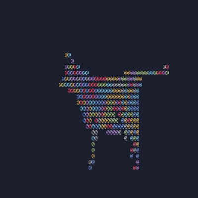

# rogue_rasterizer

A simple software rasterizer written for learning purposes using the tutorial [Scratchapixel: Rasterization Practical Implementation](https://www.scratchapixel.com/lessons/3d-basic-rendering/rasterization-practical-implementation).

> Rasterization is the task of taking an image described in a vector graphics format (shapes) and converting it into a raster image (a series of pixels, dots or lines, which, when displayed together, create the image which was represented via shapes).

In this case we are taking as input a shape defined by triangles in 3D cooridnates (.geo file) and camera coordinates/orientation and then outputting the 2D projection of the camera's perspective as an image (.ppm file) or text (stdout).

Authors: [@hwacha](https://github.com/hwacha) and [@sourenp](https://github.com/Sourenp)

### Run

#### Usage
```
# Usage: ./main <geo_file_path> image/text
```

#### Compile
```bash
c++  -o main src/main.cpp -std=c++11 -O3 
```

#### Image output
```
./main "data/cow.geo" image
open output.ppm
```


#### Text output
```
./main "data/cow.geo" text
```




### Todo

- [ ] Perspective correct vertex attribute interpolation (color)
- [ ] Import color from model instead of assigning random colors
- [ ] Set output size, camera position/orientation and text character via command line options
- [ ] Clean up and optimize code
